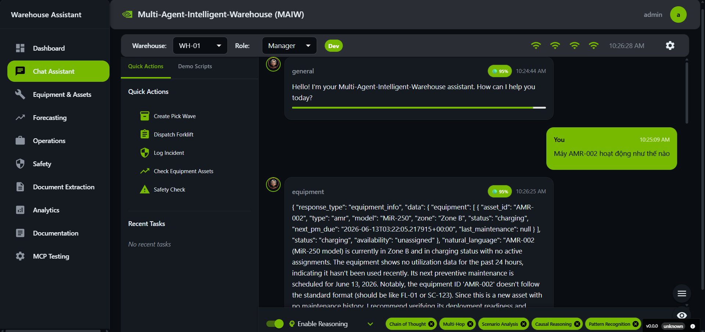
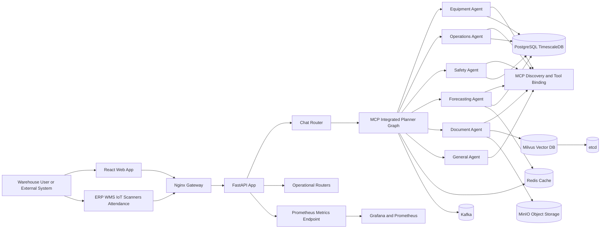

<div align="center">
  

  <h1>Multi-Agent-Intelligent-Warehouse</h1>
  <p><strong>NVIDIA Blueprint-aligned warehouse operations stack with LangGraph, MCP, FastAPI, React, TimescaleDB, Milvus, and optional GPU acceleration.</strong></p>

  <p>
    <a href="LICENSE"></a>
    
    
    
    
    
    
  </p>

  <p>
    <a href="#overview">Overview</a> ·
    <a href="#system-flow">System Flow</a> ·
    <a href="#quick-start">Quick Start</a> ·
    <a href="#application-pipelines">Application Pipelines</a> ·
    <a href="#repository-map">Repository Map</a> ·
    <a href="#docs-index">Docs Index</a>
  </p>
</div>

## Overview

This repository is a warehouse operations assistant organized around one primary user journey: a web user or upstream system sends a question or business action request, the backend classifies intent, routes it through an MCP-enabled LangGraph planner, invokes a specialized agent, enriches the answer with evidence and operational context, and returns a response to the UI.

The stack is broader than a single chatbot. It combines:

| Surface | What it does | Runtime anchor |
| --- | --- | --- |
| Web console | Dashboard, chat, equipment, operations, safety, forecasting, documents | `src/ui/web` |
| API platform | FastAPI routes, auth, metrics, middleware, health | `src/api/app.py` |
| Planner/orchestrator | LangGraph + MCP routing across domain agents | `src/api/graphs/mcp_integrated_planner_graph.py` |
| Domain agents | Equipment, operations, safety, forecasting, document, general | `src/api/agents` |
| Data layer | PostgreSQL/TimescaleDB, Redis, Kafka, Milvus, MinIO, etcd | `deploy/compose/docker-compose.dev.yaml` |
| Bring-up automation | Port resolution, compose up, migrations, seed users, smoke checks | `scripts/run_all_services.sh` |

## What Is In Scope

| Capability | Current implementation |
| --- | --- |
| Multi-agent warehouse assistant | Implemented with planner graphs, MCP helpers, and specialized agents |
| Operational APIs | Implemented across chat, auth, equipment, operations, safety, inventory, document, forecasting, training |
| Document workflow | Implemented as an MCP-enabled document agent and document routes; processing narrative is richer than some concrete tool paths |
| Forecasting | Implemented with direct forecasting tools, reorder recommendations, and optional RAPIDS acceleration |
| Hybrid retrieval | Structured + vector architecture exists; some vector paths still fall back or remain partial in source |
| Monitoring | Metrics endpoint and alert checker are wired; observability exists but is not a full managed platform by itself |

## System Flow



## Quick Start

The most reliable local bring-up path in this repository is the scripted flow below. It is more complete than the minimal top-level compose stub because it resolves ports, starts the dev stack, applies migrations, provisions default users, and runs smoke checks.

```bash
git clone https://github.com/NVIDIA-AI-Blueprints/Multi-Agent-Intelligent-Warehouse.git
cd Multi-Agent-Intelligent-Warehouse
cp .env.example deploy/compose/.env
./scripts/run_all_services.sh
```

AI Hub installs keep host ports inside `6000-6050`. After the script succeeds, the main entrypoints are:

| Endpoint | Default URL |
| --- | --- |
| Frontend | `http://localhost:6009` |
| Nginx gateway | `http://localhost:6010` |
| Backend API | `http://localhost:6008` |
| API docs | `http://localhost:6008/docs` |
| Metrics | `http://localhost:6008/api/v1/metrics` |

The compose infra defaults are PostgreSQL `6000`, Redis `6001`, Kafka `6002`, etcd `6003`, MinIO API `6004`, MinIO console `6005`, Milvus gRPC `6006` and Milvus HTTP `6007`. If a port is busy, `scripts/run_all_services.sh` searches the same `6000-6050` range.

Default seeded credentials are `admin / changeme` and `user / changeme` unless overridden in environment variables.

## Application Pipelines

### 1. Chat And Orchestration

1. The user sends a request to `POST /api/v1/chat`.
2. FastAPI middleware handles security headers, request sizing, metrics, and rate limiting.
3. The chat router applies safety checks, deduplication logic, timeout strategy, and planner invocation.
4. The MCP integrated planner graph classifies intent and routes to equipment, operations, safety, forecasting, document, or general handling.
5. The selected agent returns a structured response that is enriched with evidence, memory, actions, and validation before going back to the UI.

### 2. Document Intelligence

1. Document-related requests are routed into the document agent and document API surface.
2. The document agent classifies document intent such as upload, status, search, validation, or analytics.
3. Document actions use dedicated document tooling and describe a staged pipeline around preprocessing, OCR, extraction, quality validation, and routing.
4. Structured metadata persists in PostgreSQL while vector retrieval targets Milvus-backed search surfaces.

### 3. Forecasting And Reorder Intelligence

1. Forecasting requests reach the forecasting agent or forecasting routes.
2. The agent fast-paths obvious forecasting intents to avoid unnecessary LLM latency.
3. Forecasting action tools return single-SKU forecasts, batch forecasts, reorder recommendations, dashboard data, and business intelligence summaries.
4. Optional RAPIDS acceleration can improve model execution when NVIDIA GPU dependencies are present.

### 4. Retrieval

1. The retrieval layer separates structured inventory-style questions from documentation or knowledge-style questions.
2. SQL retrieval targets stock, inventory, and operational entities in PostgreSQL and TimescaleDB.
3. Vector retrieval is designed around Milvus for unstructured content and semantic recall.
4. Hybrid retrieval combines both sources when the query spans structured and unstructured evidence.

### 5. Bring-Up And Deployment

1. `scripts/run_all_services.sh` copies environment files when needed.
2. It resolves port conflicts before startup.
3. It brings up TimescaleDB, Redis, Kafka, etcd, MinIO, Milvus, backend, frontend, and nginx, plus optional NIM.
4. It applies SQL migrations idempotently.
5. It seeds default users and performs smoke checks against health, auth, and chat.

## Deployment Profiles

| Profile | File | Purpose |
| --- | --- | --- |
| Local dev stack | `deploy/compose/docker-compose.dev.yaml` | Main developer workflow used by `scripts/run_all_services.sh` |
| Default compose stub | `deploy/compose/docker-compose.yaml` | Minimal example, not the full dev environment |
| GPU compose | `deploy/compose/docker-compose.gpu.yaml` | NVIDIA-focused runtime profile |
| Monitoring compose | `deploy/compose/docker-compose.monitoring.yaml` | Adds Prometheus and Grafana support |
| RAPIDS compose | `deploy/compose/docker-compose.rapids.yml` | Forecasting acceleration profile |
| CI compose | `deploy/compose/docker-compose.ci.yml` | Automated pipeline support |

## Repository Map

| Path | Why it matters |
| --- | --- |
| `src/api/app.py` | FastAPI entrypoint and middleware registration |
| `src/api/routers/chat.py` | Main chat request pipeline |
| `src/api/graphs/mcp_integrated_planner_graph.py` | Primary MCP-aware planner graph |
| `src/api/graphs/planner_graph.py` | Non-MCP graph variant for baseline routing |
| `src/api/agents` | Domain-specific business agents |
| `src/retrieval` | Structured, vector, hybrid, caching, and routing logic |
| `src/ui/web/src/App.tsx` | Frontend route map |
| `scripts/run_all_services.sh` | Real bring-up pipeline |
| `data/postgres` | Core database schema and migrations |
| `monitoring` | Prometheus, Grafana, and alerting assets |

## Frontend Surfaces

The React app exposes more than the chat view. The route map includes dashboard, chat, equipment, forecasting, operations, safety, document extraction, analytics, documentation, and MCP test surfaces.

| Route family | UX focus |
| --- | --- |
| `/` | Executive dashboard |
| `/chat` | Multi-agent conversation interface |
| `/equipment` | Asset and telemetry management |
| `/forecasting` | Demand forecasting and reorder insights |
| `/operations` | Workforce and task coordination |
| `/safety` | Safety and incident workflows |
| `/documents` | Document extraction and status |
| `/documentation/*` | Built-in product docs and guides |

## Docs Index

| Topic | File |
| --- | --- |
| Deployment | `DEPLOYMENT.md` |
| Architecture overview | `docs/architecture/REASONING_ENGINE_OVERVIEW.md` |
| MCP details | `docs/architecture/mcp-api-reference.md` |
| GPU acceleration | `docs/architecture/mcp-gpu-acceleration-guide.md` |
| Database migrations | `docs/architecture/database-migrations.md` |
| Secrets and configuration | `docs/secrets.md` |
| API docs | `docs/api/README.md` |
| Testing | `docs/testing` |

## Notes On Accuracy

This README is intentionally aligned to the current code path instead of repeating every historical claim from older documentation.

| Topic | Current wording choice |
| --- | --- |
| Agent count | Treat the system as six effective routes because a general agent exists alongside the specialized domains |
| GPU acceleration | Presented as optional, not assumed |
| Guardrails | Described as safety handling and guardrail-style checks instead of claiming a complete policy engine everywhere |
| Retrieval | Described as hybrid architecture with some partial or evolving vector paths |

## Contributing

See `CONTRIBUTING.md` for workflow and contribution expectations.

## License

Licensed under Apache 2.0. See `LICENSE`.
