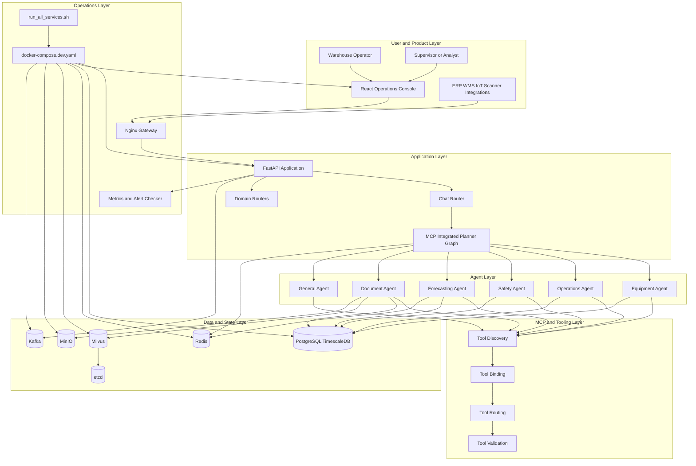

# Blog Notes: Multi-Agent Intelligent Warehouse

Tai lieu nay duoc viet de lam xuong song cho bai blog, khong phai README doi ngoai. Muc tieu la giup tach ro repo nay dang lam gi, pipeline thuc te ra sao, va nen viet blog theo goc nao de vua hap dan vua dung voi source hien tai.

## 1. Ban chat cua du an

Du an nay khong chi la mot chatbot cho kho van. No la mot nen tang warehouse operations assistant gom nhieu lop: giao dien web, API backend, bo planner dieu phoi agent, cac domain agent, lop retrieval, va stack ha tang du lieu. Phan quan trong nhat de nhin du an nay dung huong la: tat ca cac khoi xung quanh deu phuc vu mot flow trung tam, do la nhan cau hoi hoac lenh van hanh, phan loai muc dich, chuyen vao agent phu hop, goi tool va du lieu nen, sau do tra ve cau tra loi co tinh nghiep vu.

Neu viet blog, can nhan manh day la mot khoi "operational AI system" hon la mot demo LLM. Gia tri cua repo nam o cho no dong goi quy trinh kho van thanh cac domain ro rang: equipment, operations, safety, forecasting, document, va mot nhom general fallback.

## 2. Pipeline van hanh that cua he thong

Pipeline runtime thuc te trong source hien tai di theo truc sau:

1. Nguoi dung thao tac tren frontend React hoac he thong ngoai di qua gateway.
2. Request vao FastAPI app tai `src/api/app.py`.
3. Middleware xu ly security headers, CORS, rate limit, request size, metrics.
4. Neu la chat request, `src/api/routers/chat.py` se xu ly safety check, duplicate control, timeout strategy, va goi planner graph.
5. Planner graph MCP/LangGraph tai `src/api/graphs/mcp_integrated_planner_graph.py` phan loai intent va route sang agent phu hop.
6. Agent chuyen sang lop tool, retrieval, database, hoac tac vu domain.
7. Ket qua duoc tong hop, gan them evidence, quick actions, memory, confidence, roi tra ve frontend.

Y nghia cua pipeline nay la: blog khong nen mo ta he thong theo cach "frontend goi backend va backend goi database" qua don gian. Neu viet hay, can nhan manh lop planner la trung tam cua kien truc vi chinh no bien mot API thong thuong thanh mot he thong da agent.

## 3. Bring-up va deployment nen duoc mo ta the nao

Docs cu co nhieu huong dan, nhung khi doi chieu voi source thi duong bring-up dang tin cay nhat hien tai la `scripts/run_all_services.sh`. Script nay quan trong vi no khong chi `docker compose up`, ma con:

1. Kiem tra docker compose.
2. Tao `.env` neu chua co.
3. Tu dong resolve xung dot cong.
4. Khoi dong TimescaleDB, Redis, Kafka, etcd, MinIO, Milvus, backend, frontend, nginx, va tuy chon NIM.
5. Doi database san sang.
6. Apply migration theo kieu idempotent.
7. Tao default users.
8. Chay smoke test cho health, auth, va chat.

Neu can viet blog thuc chien, day la diem rat dang viet: repo nay co mot script bring-up mang tinh "operational bootstrap", khong phai script minh hoa. No giai quyet ca van de cong, migration, seed data va health check trong mot luong.

## 4. Cac ung dung ben trong repo va cach nen ke ve chung

### Frontend application

Frontend nam trong `src/ui/web`, dung React 19, co route rieng cho dashboard, chat, equipment, operations, safety, forecasting, documents, analytics, documentation. Goc viet blog nen la: UI nay dong vai tro "warehouse operations console", khong chi la mot chat box. Nghia la nguoi doc de hieu repo nay la mot product skeleton, khong phai chi la API sample.

### Backend application

Backend FastAPI la lop host cho toan bo API nghiep vu. Ngoai chat con co router cho health, auth, equipment, operations, safety, inventory, document, advanced forecasting, training, MCP. Goc viet blog nen la: backend nay la operational shell, de domain capability duoc expose vua qua chat, vua qua route nghiep vu truc tiep.

### Planner and agent application

Day la trung tam cua gia tri repo. Planner graph dung LangGraph de route sang cac domain agent. Khi viet blog, nen trinh bay no nhu mot "warehouse control brain": nhan y dinh, route theo domain, goi tool, tong hop phan hoi. Diem hay la repo co bien the planner graph co MCP va khong MCP, cho thay qua trinh tien hoa kien truc.

### Document intelligence application

Document pipeline trong code duoc xay theo tinh than xu ly upload, OCR, extraction, validation, analytics, va search. Trong blog, nen nhan manh vai tro nghiep vu: hoa don, bien ban giao nhan, purchase order, receipt, BOL. Day la goc rat de viet vi no gan voi tinh huong kho van that, va cho thay multi-modal AI khong bi tach roi khoi domain.

### Forecasting and inventory intelligence application

Forecasting agent la mot nhanh rat dep de viet blog vi no ket hop AI, nghiep vu ton kho, va kha nang tang toc GPU. No khong dung forecasting de trinh dien, ma day den reorder recommendation, dashboard, business intelligence. Day la "bridge" giua AI modeling va van hanh kho.

### Retrieval application

Repo duoc thiet ke theo huong hybrid retrieval: du lieu co cau truc vao SQL, du lieu tai lieu vao vector. Trong bai blog, nen viet no nhu mot he thong truy hoi hai toc do: SQL de lay su that van hanh, vector de lay tri thuc va tai lieu. Tuy nhien, can viet trung thuc rang trong source hien tai, mot so duong vector van cho thay tinh chat dang hoan thien.

## 5. Cac pipeline can tach thanh section rieng trong blog

### Chat to action pipeline

Nen co mot section rieng mo ta hanh trinh tu chat message thanh action nghiep vu. Day la section giup nguoi doc nhin thay su khac biet cua repo so voi mot chatbot thong thuong.

### Document to structured data pipeline

Nen viet mot section rieng cho tai lieu, boi vi no cho thay AI duoc dua vao quy trinh warehouse paperwork. Day la diem rat hop de dua anh luong OCR va extraction vao blog neu sau nay co them screenshot.

### Forecast to reorder pipeline

Nen co mot section rieng cho forecasting. Goc hay nhat la: du bao khong phai diem dung, no la input de sinh reorder recommendation va dashboard quyet dinh.

### Bring-up to smoke-check pipeline

Mot blog ky thuat thuc chien rat nen co section nay, vi no giup nguoi doc hieu repo co kha nang chay that va team da nghi den operational readiness.

## 6. Dieu can viet trung thuc de tranh overclaim

Khi doi chieu docs va source, co vai diem nen viet can than:

1. He thong dang co hieu luc route den sau nhom agent thay vi nam neu tinh ca general fallback.
2. GPU acceleration la tuy chon, khong nen viet nhu mot dieu mac dinh luon san sang.
3. Monitoring va guardrails co ton tai, nhung nen mo ta dung muc do "co tich hop" thay vi "hoan thien toan dien" o moi nhanh.
4. Hybrid retrieval la huong kien truc dung, nhung khong nen khang dinh moi nhanh vector deu day du nhu marketing copy.

Neu bai blog giu duoc su trung thuc nay, no se thuyet phuc hon nhieu va tranh bi bat loi khi nguoi doc mo source.

## 7. Cac goc viet blog rat hop

### Goc 1: Warehouse AI control plane

Viet repo nay nhu mot control plane cho van hanh kho, noi planner graph la bo nao, frontend la mat giao tiep, database va retrieval la tri nho, con domain agents la cac to doi tac nghiep.

### Goc 2: Tu chat sang nghiep vu

Viet cach he thong bien mot tin nhan thanh query nghiep vu, tra cuu du lieu, va hanh dong co cau truc. Goc nay de tiep can, de demo, va hop voi nguoi doc san pham.

### Goc 3: Multi-agent AI nhung van dat business process o trung tam

Viet ve cach repo khong dung agent de "trang tri", ma gan agent voi equipment, operations, safety, forecasting, document. Goc nay hop voi audience kien truc he thong va enterprise AI.

### Goc 4: Cach dung MCP de mo rong domain tools

Neu muon blog sau hon ve architecture, co the tach rieng mot bai ve MCP tool discovery, tool binding, va cach planner graph co kha nang route den tool theo domain.

### Goc 5: CPU-first, GPU-enhanced architecture

Viet ve cach forecasting va AI stack co the chay o che do co ban, sau do nang cap bang RAPIDS va NIM khi co ha tang NVIDIA. Goc nay hay cho audience muon modernize dan dan.

## 8. So do Mermaid de dua thang vao blog

## 9. Dinh huong bo cuc bai blog de viet nhanh

Neu muon ra bai nhanh va chat, co the di theo bo cuc sau:

1. Mo bai bang van de: tai sao kho van can he thong AI co kha nang route theo domain thay vi chi co chat thuong.
2. Gioi thieu repo nhu mot operational AI platform.
3. Giai thich runtime pipeline chat sang agent sang tool sang data.
4. Tach rieng hai pipeline hay nhat: document intelligence va forecasting.
5. Cho so do Mermaid de dong khung kien truc.
6. Ket bai bang bai hoc kien truc: multi-agent chi co y nghia khi gan chat voi quy trinh nghiep vu va tool thuc te.

## 10. Thong diep chot nen giu cho toan bo chuoi blog

Thong diep manh nhat cua repo nay la: he thong AI cho doanh nghiep co gia tri khi no duoc buoc vao workflow, du lieu, va deployment pipeline that. Repo nay dang the hien dieu do kha ro: co UI de van hanh, co API de hop nhat capability, co planner graph de dieu phoi, co stack du lieu de phuc vu agent, va co bring-up script de chay thanh mot he thong that.